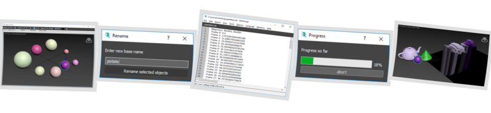
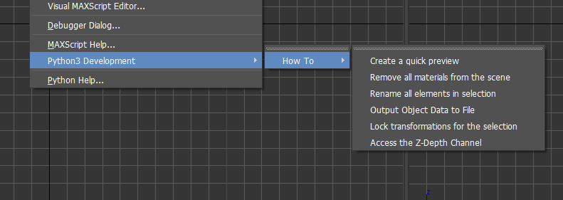

# How To - Practical Examples For Python

This repo contains various python programming samples.

All the examples in the tutorials are implemented as pip packages. This is a bit heavy for
small things (we provide a setup.py, a LICENSE and everything) but makes things installable
and shareable more easily. As soon as something has dependencies on external packages or requires
more than one python file, pip packages become very convenient. Because we think it is a good
practice to package 3ds Max python tools with pip, we provide all our examples in this form.

## Installing 

The [install.sh](install.sh) script can be used from bash
to install the samples in 3ds Max.

This operation will add a python3 scripting menu to 3ds Max:

The examples and some development goodies will be made available from there.

The installation does the following:
- it installs pip in your 3ds Max installation if it's not already there
- it installs pystartup.ms that enables auto start pip packages
- it installs all the samples in --user and -e mode with pip

## Packages that are not examples but that are provided in this repo

- [menuhook](menuhook/README.md) is not meant to be an example (but is still interesting as such!) but
as a way of attaching python functions to 3ds Max menu items. The menuhook package is used by 
most of the other samples.

- [realoadmod](reloadmod/README.md) is small tool that will reload all development modules in one
operation

- [mxvscode](mxvcscode/README.md) is a small tool that will automatically import ptvsd (the
VSCode debugging interface) during the startup of 3ds Max and make it accept remote connections.
This may slow down the startup of 3ds Max quite a bit and is meant as a developer-only tool.

## Python How Tos

The samples below are translations of [MAXScript How Tos](https://help.autodesk.com/view/3DSMAX/2020/ENU/?guid=GUID-25C9AD58-3665-471E-8B4B-54A094C1D5C9) that
can be found in the 3ds Max online documentation.

The conversion from MaxScript to Python could have been more mechanical but we chose to implement
the python version in the best python way known to us. An example of this is that we use PySide2
(Qt) for the UI as much as possible instead of using more traditional 3ds Max ui mechanisms.

*How To?*

- Develop a Transform Lock Script [transformlock](transformlock/README.md)
- Remove all materials [removeallmaterials](removeallmaterials/README.md)
- Quickly rename selected objects [renameselected](renameselected/README.md)
- Output Object Data to File [speedsheet](speedsheet/README.md)
- Create a quick video preview [quickpreview](quickpreview/README.md)
- Access the Z-Depth Channel [zdepthchannel](zdepthchannel/README.md)

## Python Examples that don't come from maxscript howtos

- Update a progressbar from a python thread [threadprogressbar](threadprogressbar/README.md)

## 3dsMax startup entry point

[pystartup](pystartup/README.md) provides the maxscript code that, when copied in 3ds Max's
startup directory, will automatically launch pip packages with the 3dsMax startup
entry point.

## Extra Goodies

- [create.sh](create.sh) will generate an empty pip package in the current working directory.
- [install.sh](install.sh) will install pip, install pystartup and pip install all the samples
- [checks.sh](checks.sh) runs pylint on the code, validates that 3ds Max is named properly,
validates that code blocks in markdown always specify the programming language
- [makepreview.sh](makepreview.sh) regenerates the Splash.png for the repo
