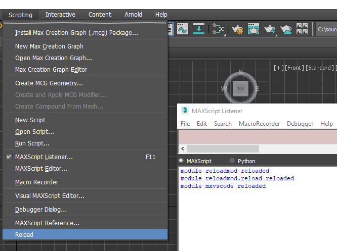

# reloadmod



This pip package adds a menu item in max that will reload
all development pip packages in one operation.


## Installation

```
cd $maxroot/Python37
Python.exe -m pip install --user /path/to/reloadmod
```

On the next max startup the menu item will appear

