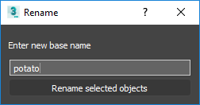

# HowTo: renameselected



[Original MaxScript Tutorial](https://help.autodesk.com/view/3DSMAX/2020/ENU/?guid=GUID-5986CAD3-BB68-47BC-B4B2-EF84C4659271)
[Source Code](renameselected/__init__.py)

*Goals:* 
- learn how to create a dialog with PySide2
- learn how to hook a python function to a 3ds Max ui element

## Explanations

This tutorial shows how to rename all selected objects using a base name,
chosen in a PySide2 dialog.

## Using the tool

From the 3ds Max listener window we can do:

```python
import renameselected

renameselected.startup()
```

Then from the Scripting menu we can use the renameselected menu item to use
the feature.

If we install this sample as a pip package it will be automatically
started during the startup of 3ds Max (because it defines a startup
entry point for max).

## Understanding the code

The renaming is done in the `renameselected` function that receives a base name
in its text parameter. Then `rt.uniquename(text)` is used for generating a unique
version of this base name for each item in the selection.

```python
def renameselected(text):
    '''Rename all elements in selection'''
    if text != "":
        for i in rt.selection:
            i.name = rt.uniquename(text)
```

This function is called whenever the `Rename selected objects` button of a dialog
is pressed. This dialog is implemented in [ui.py](renameselected/ui.py).

We declare a QDialog subclass, and make sure it receives a click function in its
constructor. This click function will be our renameselected function:

```python
class PyMaxDialog(QDialog):
    """
    Custom dialog attached to the 3ds Max main window
    """
    def __init__(self, click, parent=QWidget.find(rt.windows.getMAXHWND())):
```

We then populate the dialog with various widgets:

```python
        super(PyMaxDialog, self).__init__(parent)
        self.setWindowTitle('Rename')

        main_layout = QVBoxLayout()
        label = QLabel("Enter new base name")
        main_layout.addWidget(label)

        edit = QLineEdit()
        main_layout.addWidget(edit)

        btn = QPushButton("Rename selected objects")
```

And make sure its push button calls the click function when clicked:

```python
        btn.clicked.connect(lambda : click(edit.text()))
        main_layout.addWidget(btn)

        self.setLayout(main_layout)
        self.resize(250, 100)
```

Finally, in [__init__.py](renameselected/__init__.py) we create a menu item that
will show the dialog.

```python
def startup():
    """
    Hook the funtion to a menu item.
    """
    menuhook.register(
        "howtos",
        "renameselected",
        showdialog,
        menu="&Scripting",
        text="renameselected sample",
        tooltip="renameselected sample")
```

The showdialog function simply does this:

```python
def showdialog():
    dialog = ui.PyMaxDialog(renameselected)
    dialog.show()
```
