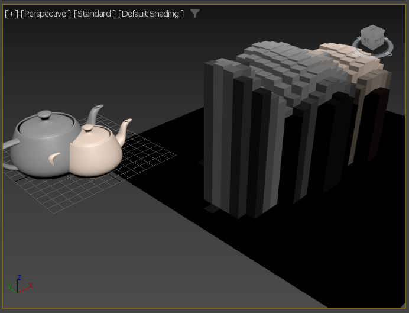

# mxs2py: a maxscript to python transpiler


mxs2py takes a MAXScript program, parses it to a syntax tree, and then produces equivalent Python
code from the syntax tree.

## Why?

Help python programmers make sense of maxscript samples by providing automatic translation
to python.

## State of the Project (= experimental, not supported)

This is experimental work and provided only as a sample

As things are:

- most correct maxcript syntax will be parsed correctly
- parsing errors are very poorly reported (trying to translate invalid maxscript code will not be a fun
experience)
- some maxscript constructs are still not supported by the code generator. Most of the time, when things
cannot be translated to python, a warning is emitted in the generated code explaining why. 
- constructs like plugin, tool, custom attributes, etc. are parsed but then the python support is either
inexistant or limited 
- some generated python constructions may be correct but awkward (because implementing it this way was
easier)
- I'm interested to see if this is useful to someone before investing more time into it


But: the translator can be used in a lot of situations.

## Example

The following maxscript code from [the maxcript howtos](https://help.autodesk.com/view/MAXDEV/2022/ENU/?guid=GUID-3667A33C-E3E4-4F39-A480-3713240838F1)

```maxscript
renderers.current = Default_Scanline_Renderer()
delete $VoxelBox*
rbmp = render outputsize:[32,32] channels:#(#zdepth) vfb:off
z_d = getchannelasmask rbmp #zdepth
progressstart "Rendering Voxels..."
for y = 1 to rbmp.height do
(
 if not progressupdate (100.0 * y / rbmp.height) then exit
 pixel_line = getpixels rbmp [0,y-1] rbmp.width
 z_line = getpixels z_d [0,y-1] rbmp.width
 for x = 1 to rbmp.width do
 (
  b = box width:10 length:10 height:(z_line[x].value/2)
  b.pos = [x*10,-y*10,0]
  b.wirecolor = pixel_line[x]
  b.name = uniquename "VoxelBox"
 )--end x loop
)--end y loop
progressend()
```

Will be translated into the following python code:
(which is essentially the same as [zdepthchannel](https://github.com/ADN-DevTech/3dsMax-Python-HowTos/tree/master/src/packages/zdepthchannel),
but mechanically translated).

```python
'''Converted from MAXScript to Python with mxs2py'''
from pymxs import runtime as rt
import mxsshim
rt.renderers.current = rt.default_scanline_renderer()
rt.delete(mxsshim.path("$VoxelBox*"))
rbmp = rt.render(outputsize=rt.point2(32, 32), channels=rt.array(rt.name("zdepth")), vfb=False)
z_d = rt.getchannelasmask(rbmp, rt.name("zdepth"))
rt.progressstart("Rendering Voxels...")
for y in range(int(1), 1 + int(rbmp.height)):
    if not rt.progressupdate(100.0 * y / rbmp.height):
        break
    pixel_line = rt.getpixels(rbmp, rt.point2(0, y - 1), rbmp.width)
    z_line = rt.getpixels(z_d, rt.point2(0, y - 1), rbmp.width)
    for x in range(int(1), 1 + int(rbmp.width)):
        b = rt.box(width=10, length=10, height=(z_line[x - 1].value / 2))
        b.pos = rt.point3(x * 10, -y * 10, 0)
        b.wirecolor = pixel_line[x - 1]
        b.name = rt.uniquename("VoxelBox")
# end x loop
# end y loop
rt.progressend()
```

Which works producing :


## Under the hood
- The code uses parsec to parse maxscript syntax into a syntax tree
- It then appliees various transformations on the syntax tree (not in a very efficient way, but in a relatively simple way)
- It then emits python code from this syntax tree

## How to use it

```
from mxs2py import topy

(output, _) = topy("rotate $ (angleaxis 90 [1,0,0])")
print(output)

```

this will print:

```python
'''Converted from MAXScript to Python with mxs2py'''
from pymxs import runtime as rt
import mxsshim
import pymxs
rt.rotate(mxsshim.path("$"), rt.angleaxis(90, rt.point3(1, 0, 0)))
```

Note that the generated code depends on [mxsshim.py](mxsshim.py)
which is a very early and incomplete emulation layer of maxscript
constructs in python.
