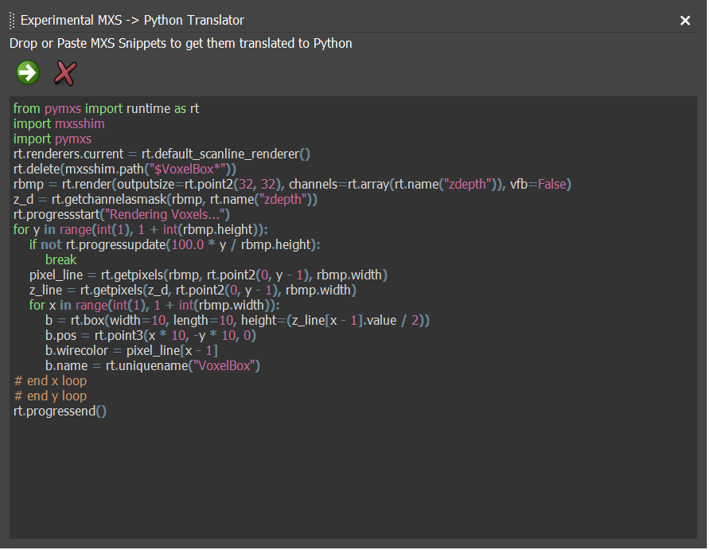

# HowTo: mxstranslate

## Experimental Translation Window (mxs -> Python)

This project uses mxs2py to implement a dock widget
containing a simple python editor. If you paste
valid code in the editor window it gets translated
to python.

THe translator is too slow for big chunks of code (and not
always giving perfect result), but can be useful to get
a Python version of maxscript snippet.
