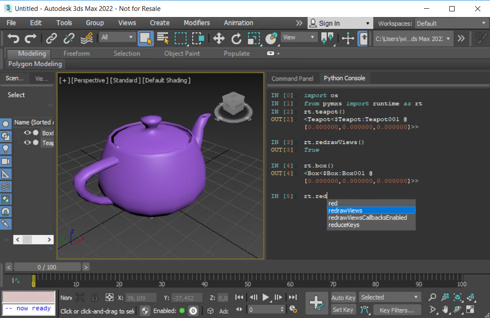

# HowTo: pyconsole



This example integrates the nice [pyqtconsole](https://github.com/marcus-oscarsson/pyqtconsole)
as an alternative to the 3ds Max Listener. The console is automatically added 
to the "RightDockWidgetArea" and tabbed on startup. A menu item allows to
create other dockable instances of the console.

This console behaves a lot more like a normal python console and 
provides syntax highlighting and autocomplete on top of that. Because
the console uses Qt, integrating it in 3ds Max is really easy.

## Understanding the code

The nice stuff is in [pyqtconsole](https://github.com/marcus-oscarsson/pyqtconsole). Here
I show how it is integrated to max.

The new\_console function:

```python
def new_console(tabto = None, floating = False, dockingarea = QtCore.Qt.RightDockWidgetArea):
    """
    Create a new console and float it as a max widget
    tabto: name of a widget on top of which the console should be tabbed
    floating: True to float the console, False to leave it docked
```


Retrieves the main 3dsMax windows. This is a Qt window.

```python
    main_window = GetQMaxMainWindow()
```

It then instanciates a new console:
```python
    # create and setup a console
    console = PythonConsole(formats=HUGOS_THEME)
    console.setStyleSheet("background-color: #333333;")
```

And creates a QDockWidget as a container for the console. 

```python
    # create a dock widget for the console
    dock_widget = QDockWidget(main_window)
    dock_widget.setWidget(console)
    dock_widget.setObjectName("pyconsole")
    dock_widget.setWindowTitle("Python Console")
    main_window.addDockWidget(dockingarea, dock_widget)
```

The widget is docked by default and optionally tabbed if
tabto is specified:

```python
    if (not tabto is None):
        tabw = main_window.findChild(QWidget, tabto)
        main_window.tabifyDockWidget(tabw, dock_widget)
```

If the floating argument is true, the widget is floated instead
of being docked. And then it is showed.

```python
    dock_widget.setFloating(floating)
    dock_widget.show()
```

Finally, the console is hooked to the qt event processing mechanism.
This is pretty awesome, no 3dsMax specific code is needed!

```python
    # make the console do stuff
    console.eval_queued()
```

The awesomeness here (aside from the [pyqtconsole](https://github.com/marcus-oscarsson/pyqtconsole) that is great) 
is really that pymxs (or any other 3ds Max specific thing) is not even needed!

The python + Qt combo in 3ds Max is really fantastic!

