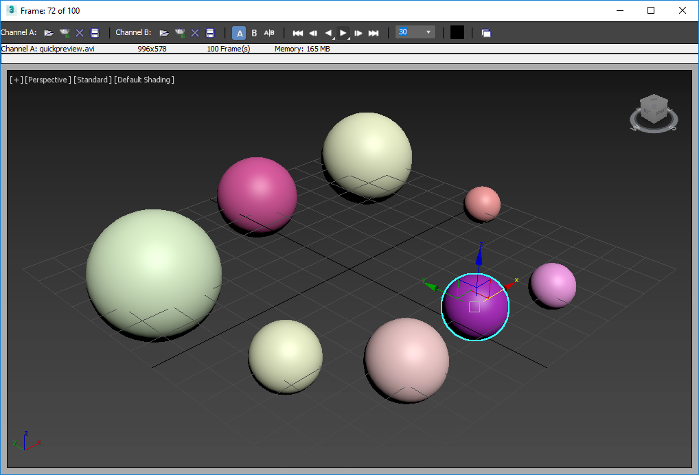

# HowTo: quickpreview



[Original MaxScript Tutorial](https://help.autodesk.com/view/MAXDEV/2022/ENU/?guid=GUID-333382D0-57AF-4797-98F2-C2BE09442607)
[Source Code](quickpreview/__init__.py) 

*Goals:* 
- learn to record preview frames of an animation

## Explanations

- Define an AVI output path name in the Previews system directory.
- Get the size of the current viewport.
- Create a bitmap with the size of the viewport and set the file name to the output path .
- Loop through all animation frames in the current segment.
- Set the slider to the time from the loop.
- Capture the viewport Device Independent Bitmap.
- Copy the DIB to the pre-defined bitmap.
- Save the current frame to disk.
- When ready with all frames, close the bitmap.
- Force garbage collection manually to clear any used memory.
- Load the ready animation in the RAM player.

## Using the tool

From the 3ds Max listener window we can do:

```python
import quickpreview

quickpreview.startup()
```

If we install this sample as a pip package it will be automatically
started during the startup of 3ds Max (because it defines a startup
entry point for 3ds Max).

## Understanding the code

We use `rt.getDir(rt.Name("preview"))` to find the default directory
for previews ([3ds Max System Directories](https://help.autodesk.com/view/MAXDEV/2022/ENU/?guid=GUID-F7577416-051E-478C-BB5D-81243BAAC8EC#GUID-F7577416-051E-478C-BB5D-81243BAAC8EC)).
We concatenate "quickpreview.avi" using the standard Python `path.join` function.

```python
    preview_name = path.join(rt.getDir(rt.Name("preview")), "quickpreview.avi")
```

We then retrieve the view size, and create a bitmap that matches this size
in the preview\_name file:

```pyhton
    view_size = rt.getViewSize()
    anim_bmp = rt.bitmap(view_size.x, view_size.y, filename=preview_name)
```

We then iterate over the animationRange, creating a bitmap from the viewport at
each frame. This bitmap is copied to the anim\_bmp that we created and then
saved.

```python
    for t in range(int(rt.animationRange.start), int(rt.animationRange.end)):
        rt.sliderTime = t
        dib = rt.gw.getViewportDib()
        rt.copy(dib, anim_bmp)
        rt.save(anim_bmp)
```

After the loop is over we close the anim\_bmp file that now contains our
animation.

```python
    rt.close(anim_bmp) 
```

We then force a garbage collection:

```python
    rt.gc()
```

And launch the [RAMPlayer](https://help.autodesk.com/view/MAXDEV/2022/ENU/?guid=GUID-650BE5AA-1DFB-4847-99B2-777A281490F6#GUID-650BE5AA-1DFB-4847-99B2-777A281490F6) for our generated avi:

```python
    rt.ramplayer(preview_name, "")
```

