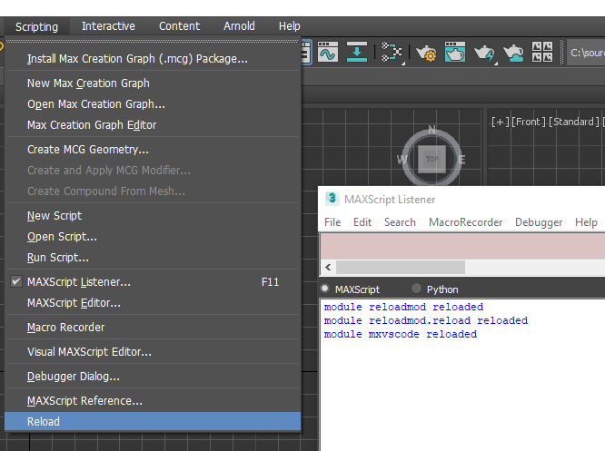

# reloadmod



This pip package adds a menu item in 3ds Max that will reload
all development pip packages in one operation.


## Installation

```bash
cd $maxroot/Python37
Python.exe -m pip install --user /path/to/reloadmod
```

On the next 3ds Max startup the menu item will appear

