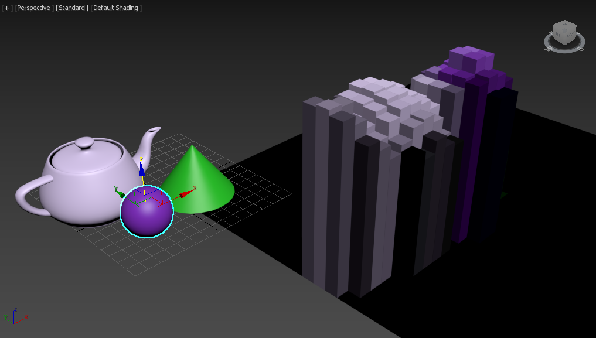

# HowTo: zdepthchannel



[Original MaxScript Tutorial](https://help.autodesk.com/view/MAXDEV/2022/ENU/?guid=GUID-3667A33C-E3E4-4F39-A480-3713240838F1)
[Source Code](zdepthchannel/__init__.py)

The 3ds Max default scanline renderer generates a multitude of additional data
channels providing information about colors, texture coordinates, normals,
transparency, velocity, coverage etc. All of these channels can be accessed for
reading via MAXScript.

The following simple script will render an image including Z-buffer depth info
and convert it into what is known as a "voxel landscape" using the depth data
to generate geometry representing the single image pixels.

*Goals:* 
- learn to access the z-buffer

## Explanations

- Delete all objects from the last session.
- Render the current view with Z-buffer info to a bitmap
- Go through all lines in the rendered image and through all pixels in each line
- For every pixel, get the color and the z-depth value and create a box representing that pixel using the color for the object’s wireframe color and the z-depth for the box’s height.
- Give each object a unique name to be able to easily delete them when needed.
- Display a progress bar to show how long it will take to go through all pixels.

## Using the tool

From the 3ds Max listener window we can do:

```python
import zdepthchannel

zdepthchannel.startup()
```

If we install this sample as a pip package it will be automatically
started during the startup of 3ds Max (because it defines a startup
entry point for 3ds Max).

## Understanding the code

Everything is done in the zdepthchannel function in [zdepthchannel/\_\_init\_\_.py](zdepthchannel/__init__.py).

We first look for objects starting by "VoxelBox". These would be the result
of previously running the code on the same scene.

Because the MAXScript `$` notation is not available in Python we use
a regex to filter `rt.objects` that match our pattern:

```python
    voxelbox = re.compile("^VoxelBox")
    for tbd in filter(lambda o: voxelbox.match(o.name), list(rt.objects)):
        rt.delete(tbd)
```

Now we render the active viewport at 32x32 resolution and store the result in
the variable rbmp . We request an additional Z-depth channel to be generated.
The Virtual Frame Buffer will be disabled during rendering.

```python
    rbmp = rt.render(outputsize=rt.Point2(32, 32), channels=[zdepth_name], vfb=False)
```

After rendering the image, we request a copy of the ZDepth channel as a
greyscale mask. It will be stored in the bitma z\_d .

```python
    z_d = rt.getChannelAsMask(rbmp, zdepth_name)
```

We start a new progress indicator with a respective caption - it will be
displayed in the status bar at the bottom of the UI.

```python
    rt.progressStart("Rendering Voxels...")
```

Now we start looping through all lines in the rendered bitmap. The variable y
will change from 1 to the height of the bitmap.

```python
    for y in range(1, rbmp.height):
        print("y =", y)
```

The progressupdate method requires a percentage value. We divide the current
bitmap line number y by the total number of lines rbmp.height . This yields a
result between 0.0 and 1.0, multiplied by 100.0 it returns a percentage between
0.0 and 100.0. To react to the Cancel button, we exit the loop if
progressUpdate returns a False value.

```python
        if not rt.progressupdate(100.0 * y / rbmp.height):
            break
```

Now we read a whole line of pixels from both the RGBA bitmap and its z-buffer.
Note that bitmap indices are 0-based and count from 0 to height minus one. This
explains the "minus one" in the vertical position value.

```python
        pixel_line = rt.getPixels(rbmp, rt.Point2(0, y-1), rbmp.width)
        z_line = rt.getPixels(z_d, rt.Point2(0, y-1), rbmp.width)
```

By counting from 1 to the width of the bitmap, we access each pixel of the
current scanline.

```python
        for x in range(1, rbmp.width):
            print("x =", x, z_line[x].value)
```

Now we create a box with width and length equal to 10, and height equal to half
the Z-buffer's grayscale value. We also set the X and Y position to every 10 th
world unit based on the pixel's coordinates. Note that we have to use the
negative y value to get the upper left corner appear up left. A bitmap starts
up left, while the positive quadrant of the MAX world space starts down left.
This way we mirror the vertical coordinate to get a valid representation of the
bitmap in the viewport.

```python
            box = rt.box(width=10, length=10, height=(z_line[x].value/2))
            box.pos = rt.Point3(x*10, -y*10, 0)
```

Using the RGB color of the rendered pixel, we assign a new wireframe color to
the new box.

```python
            box.wirecolor = pixel_line[x]
```

We also set its box's name to a unique name with the base "VoxelBox"

```python
            box.name = rt.uniqueName("VoxelBox")
```

After the loops are over, we can end the progress display.

```python
    rt.progressEnd()
```
